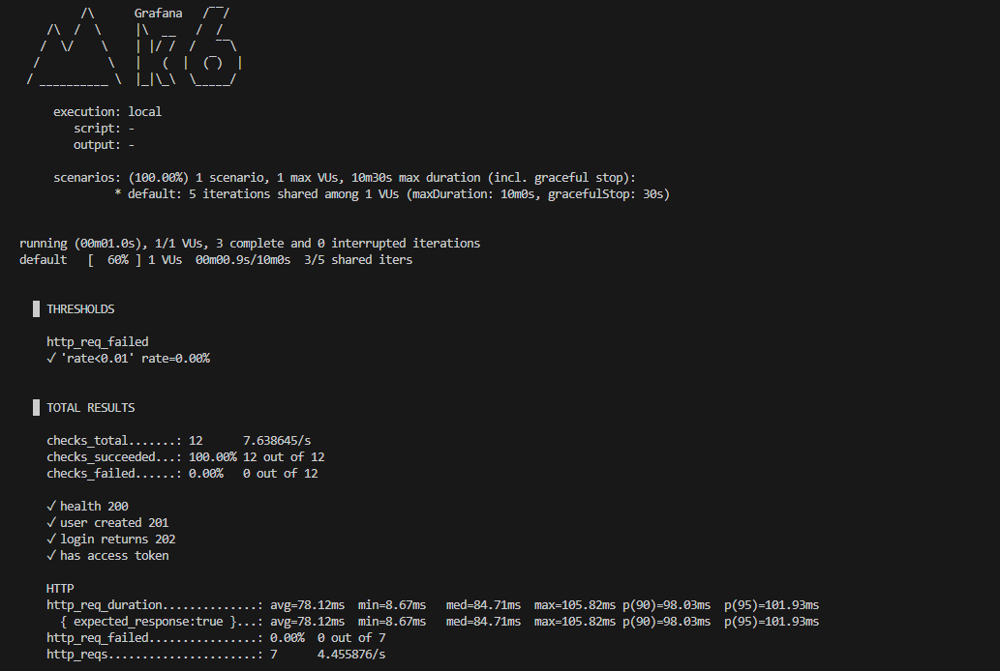
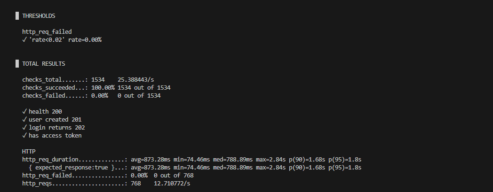
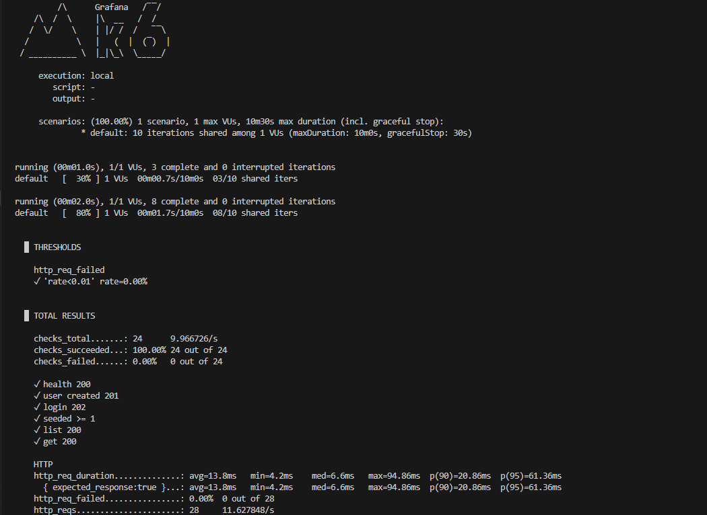
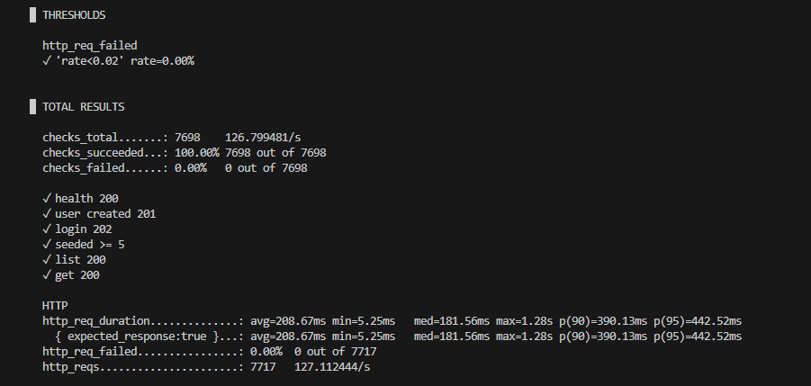
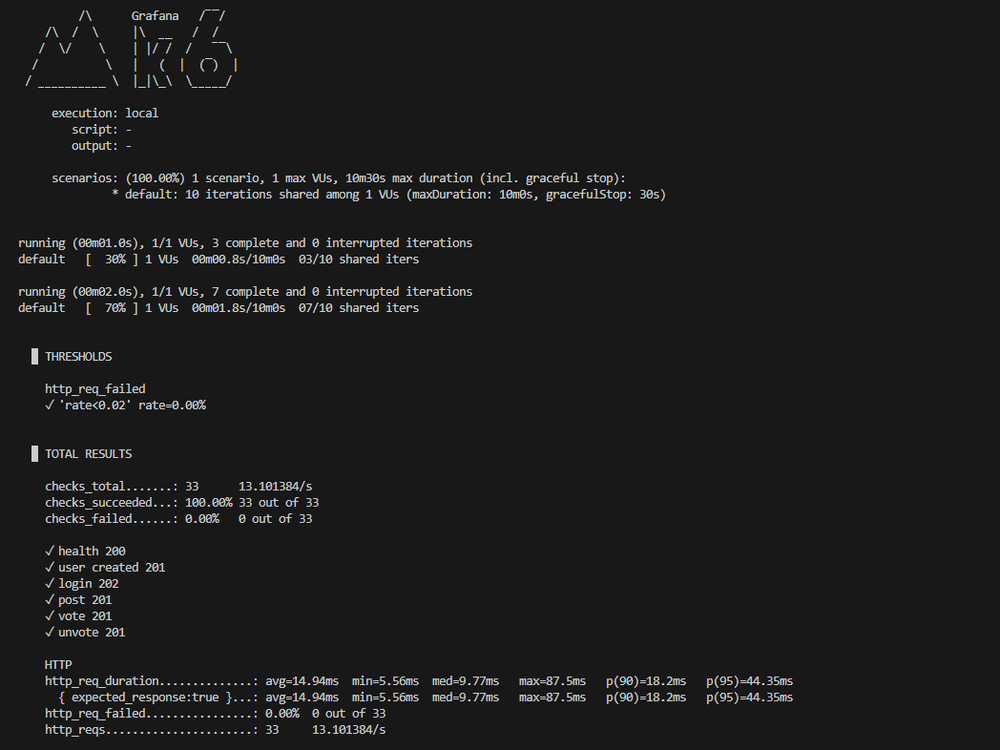
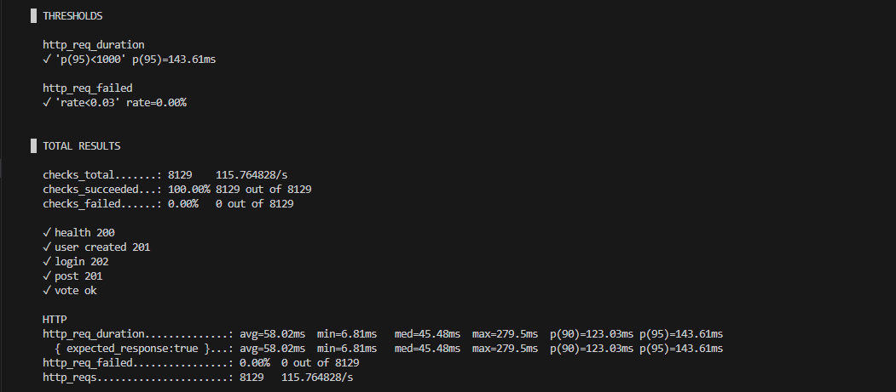
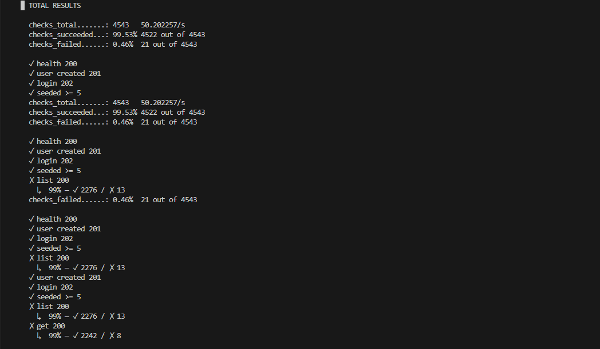

## Load and Performance Testing

Performance tests were executed using **k6** against a FastAPI + PostgreSQL backend running in Docker.

Each test dynamically creates a user and authenticates before exercising protected endpoints.

---

## Authentication Testing
Validates concurrent login behavior and JWT issuance.

### Smoke Test
- Passed all checks and thresholds

### Stress Test
- 10 VUs for 1 minute
- p95 latency: ~1.8s
- Error rate: 0%

---

## Read Testing
Evaluates database performance under concurrent read-heavy workloads.

### Smoke Test
- Passed all checks and thresholds

### Stress Test
- 60 VUs for 1 minute 30 seconds
- Multi-stage ramp-up with rapid ramp-down
- p95 latency: ~442ms
- Error rate: 0%

---

## Write Testing
Evaluates concurrent write performance (post creation and voting).

### Smoke Test
- Passed all checks and thresholds

### Stress Test
- 25 VUs for 1 minute 30 seconds
- Multi-stage ramp-up
- p95 latency: ~143ms
- Error rate: 0%

---

## Findings
- Read endpoints scale significantly better than write endpoints due to database I/O constraints
- JWT authentication introduces measurable but stable overhead
- Stress testing revealed intermittent 500 errors under high load caused by response schema mismatches
- After fixing schema validation and tuning SQLAlchemy connection pooling and worker count, error rate dropped to 0% and latency stabilized

